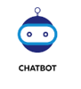

# Self Learning Supervised Chatbot

## Mattermost bot Hackfest - Open Innovation theme 

### **Problem Statement**
Lets take an example of any general service desk, it is available in all corporate functions and it is largely powered by HUMANS. This leads to a common problem, which is scalability, turn around time, resource intensive & resolving common problems over and over again.

### **Summary**

An hybrid chatbot application and an admin application portal has been developed for mattermost.Its an self learning supervised chatbot where an admin can train dataset for the user's keyword or queries with  multiple source types(Api,Crawl,Text,Link,Docs) to return the response to the user with quicker turn around time and faster time to production.

Its developed as an Microservice architecure pattern and created chatbot as a service(CaaS) where we can utilise it for multiple project in an organisation.

### **Deployment**

### **Prerequisites**

**Nodejs**

### **After Installation >> Clone the project >> go to project directory**

**npm install**

### **Run the microservices**

node index.js

